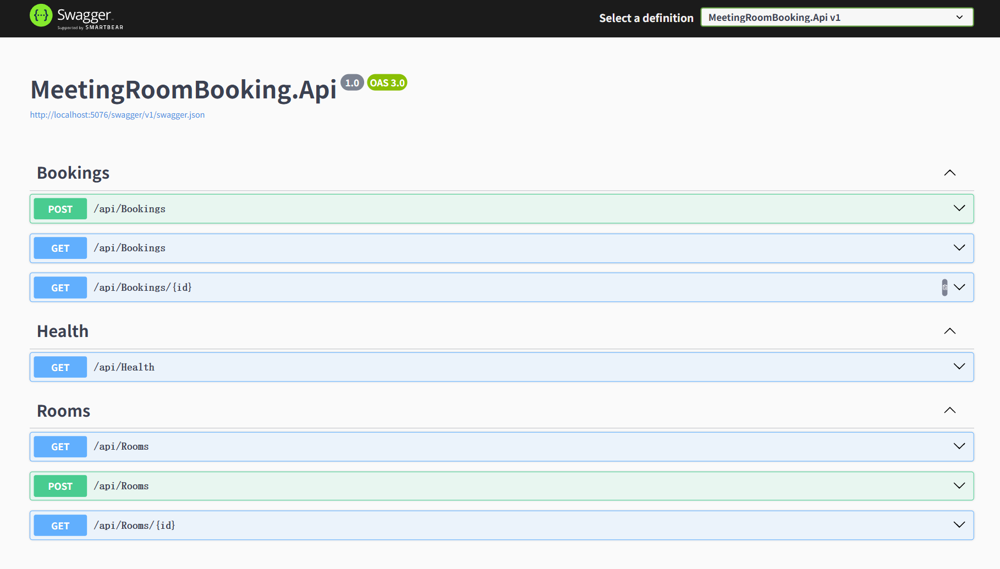

# meeting-room-reservation-api

A .NET Web API project implementing meeting room scheduling with conflict detection and clean layered architecture.

---

## Overview

The **meeting-room-reservation-api** is a backend service that allows users to reserve meeting rooms, manage availability, and prevent scheduling conflicts. It models a realistic office booking workflow: rooms have capacities and time slots, and bookings must pass validation rules before being confirmed.

Core focus of the project:
- Scheduling logic & conflict detection
- Layered backend architecture
- REST API design
- Database persistence (EF Core + SQLite)
- Ready for a future React admin/user UI

---

## Key Features

- View available meeting rooms
- Create and cancel bookings
- Prevent double-booking (time overlap validation)
- Room capacity management
- Booking history records
- Server-side validation rules

---

## Tech Stack

### Backend
- C# / .NET (ASP.NET Core Web API)
- Entity Framework Core
- SQLite (development database)

### Frontend (planned / optional)
- React + Vite

### Other
- RESTful API
- JSON DTOs

---

## Architecture

The project follows a layered architecture:

API Controller → Application/Service → Domain → Infrastructure (EF Core) → Database

Responsibilities:
- **Controllers**: HTTP handling only
- **Services**: booking rules & business logic
- **Domain**: entities and constraints
- **Infrastructure**: database persistence

Key design decision: booking validation occurs in the **service layer** to guarantee no overlapping reservations regardless of client behavior.

---

## Core Domain

Entities:
- **Room** — capacity, name, availability
- **Booking** — time range reservation
- **User/Organizer** — booking owner

Business Rules:
- A room cannot be booked if the time slot overlaps with an existing booking
- End time must be after start time
- Capacity must support meeting size (if applicable)

---

## Run Locally

### Prerequisites
- .NET SDK 7+ (or compatible)

### Steps

```bash
git clone https://github.com/ErmaoCyber/meeting-room-reservation-api.git
cd meeting-room-reservation-api
dotnet restore
dotnet run
```

The application will start on a local development port.  
Check the console output after `dotnet run` to see the exact URL.

---

## Example API Endpoints

> Endpoint paths may vary slightly depending on your controller routes.

**Get rooms**
```
GET /api/rooms
```

**Create booking**
```
POST /api/bookings
```

**Cancel booking**
```
DELETE /api/bookings/{id}
```

---

## What This Project Demonstrates

- Designing REST APIs using ASP.NET Core
- Separation of concerns in backend systems (layered architecture)
- Implementing scheduling conflict detection
- Database integration with EF Core
- Backend service design ready for frontend integration

---

## API Documentation (Swagger)

The project exposes an interactive Swagger UI for exploring and testing API endpoints.

After starting the application:

```
dotnet run
```

Open your browser and navigate to:

```
http://localhost:<port>/swagger
```

The `<port>` number is printed in the console when the server starts.

Example (my local environment):
```
http://localhost:5076/swagger/index.html
```

From Swagger you can:
- View all available endpoints
- Send requests directly from the browser
- Inspect request and response models



---
